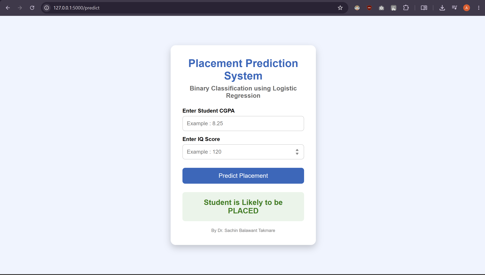
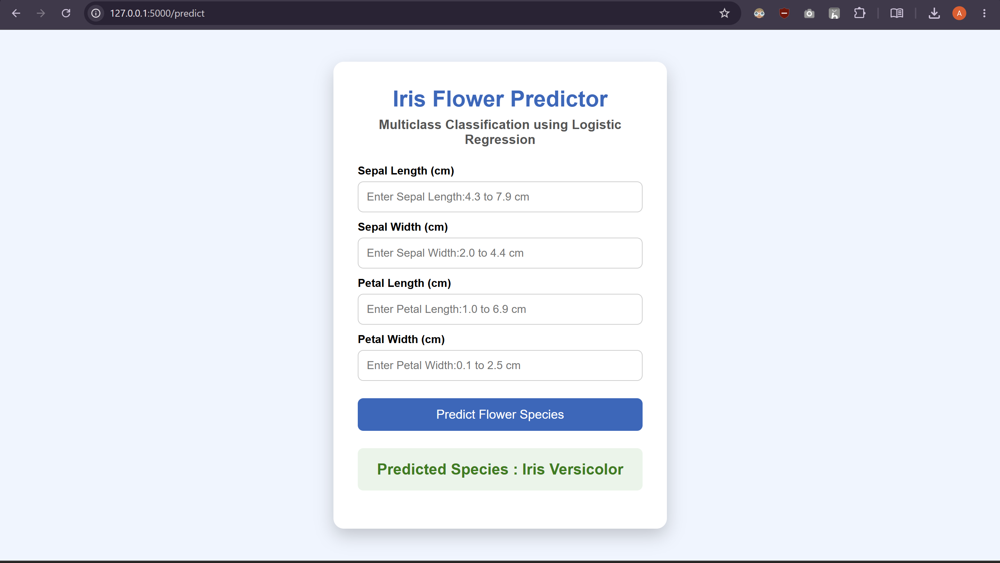

# 1.Python-Libraries

Complete Python Library Google Colab Notebooks.

---

## Libraries Included

-  NumPy
-  Pandas
-  Matplotlib
-  Seaborn
-  Scikit-learn
-  PyTorch
-  TensorFlow
-  Keras

---

## Open in Google Colab

Simply open any notebook and click **Open in Colab** to run it online.

Happy Learning! 

# Dataset

This folder contains essential concepts of data preprocessing, exploratory data analysis (EDA), feature engineering, visualization, handling missing values, encoding, feature scaling, and dataset cleaning using Python.

Also it Contains Mini Assisgnment

  

Happy Learning! 

# 2. Simple Linear Regression

This project implements **Simple Linear Regression** using Python and Machine Learning.

### Technologies

* Python
* Pandas
* NumPy
* Scikit-learn
* Flask

### How It Works

The model learns the relationship between one input feature and the output value. After training, it can predict the output for new input data.

### Project Overview

This project includes model training, prediction, and a simple Flask web application to use the trained model.

### Output :-
.png)

Happy Learning! 

# 3. Multiple Linear Regression

This project implements **Multiple Linear Regression** using Python and Machine Learning.

### Technologies

* Python
* Pandas
* NumPy
* Scikit-learn
* Flask

### How It Works

The model learns the relationship between multiple input features and the output value. After training, it can predict the output for new input data.

### Project Overview

This project includes data processing, model training, prediction, and a simple Flask web application to use the trained model.

### Output :-
.png)

Happy Learning! 

# 4. Logistic Regression for Binary Classification

This project implements **Logistic Regression** for solving a binary classification problem using Python and Machine Learning.

### Technologies

* Python
* Pandas
* NumPy
* Scikit-learn
* Flask

### How It Works

The model learns from the given dataset and predicts one of two possible classes. Logistic Regression is used to calculate the probability of an input belonging to a particular class.

### Project Overview

This project includes data preprocessing, model training, prediction, and a simple Flask web application for making predictions.

### Output :-

Happy Learning!

# 5. Multiclass Classification using Logistic Regression

### About
This Project demonstrates **Multiclass Classification using Logistic Regression** to classify data into multiple categories. It uses input features to predict the appropriate class for a given data point.

### Objective
To implement Logistic Regression for multiclass classification and predict the class of new data.

### Dataset
A dataset with multiple input features and **three or more target classes** is used for classification. The dataset is explored and divided into features and target values before training the model.

### Model
**Algorithm:** Logistic Regression  
**Type:** Multiclass Classification

The model is trained using the training data and then used to predict the classes of unseen data.

### Evaluation
The performance of the trained model is evaluated using:
- Accuracy Score
- Classification Report

### Prediction
The trained model can be used to predict the class of new input data based on the given features.

### Libraries
- Python
- Pandas
- NumPy
- Matplotlib
- Scikit-learn

### Output :-

Happy Learning!
